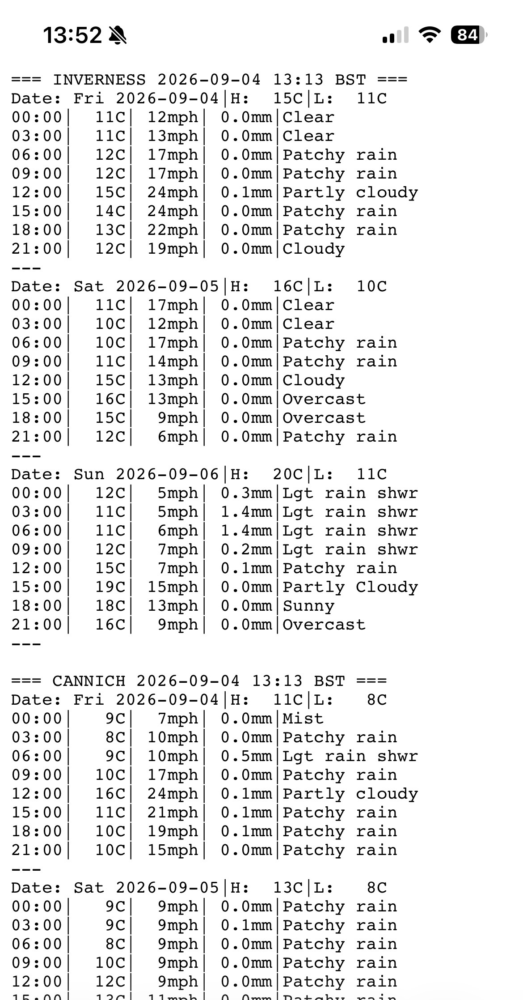
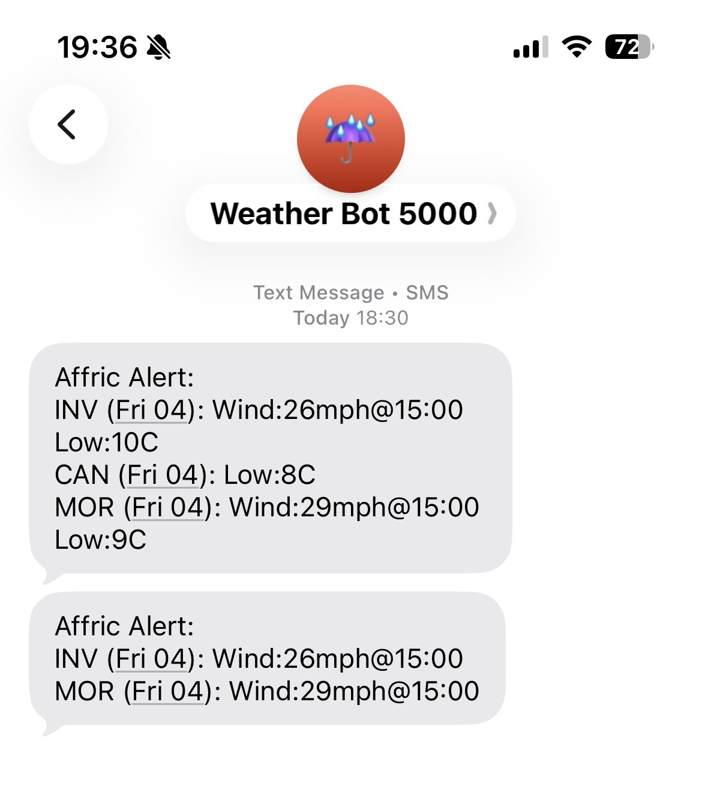

# lofi-weather

Minimal, low-bandwidth weather tools for trail walking and mobile viewing. Uses `wttr.in`, `jq`, and standard Unix utilities to deliver plain-text forecasts and proactive Twilio SMS alerts via `systemd` timers.

If this stuff isn't relatively self explanatory it is probably not for you!

## Rationale
When bandwidth is extremely low and signal fractional this is a very low bandwidth way to either receive Alerts via SMS (if no internet access) or get a forecast (with even EDGE/2G/whatever you can get)

## AI Use
This thing is about 40-50% Gemini. They are 2 simple bash scripts and AI tools were used to generate this readme, do the endless sed bit to compress the weather conditions and genericise some of the stuff from what I was using.

## Features

- **Text Forecast Generator (`weather-forecast.sh`)**: Compresses dense hourly weather data into compact, readable plain text optimized for small screens. Served statically via Nginx.
- **Proactive SMS Alerts (`weather-alert.sh`)**: Checks upcoming weather against custom threshold triggers (default is wind speed > 25mph, temperature drops < 5°C, or snow/thunder hazards) and sends concise SMS alerts using twilio.
- **Automatic**: Includes unit and timer files for hourly text updating and multi-time daily weather hazard scans.

## Screenshots

**Web Output:**

**SMS Alert:**

## Prerequisites

- `curl`
- `jq`
- `nginx` (or your chosen way of serving a plain text file)
- A Twilio Account (for SMS alerts)

## Installation & Setup

1. **Install Scripts:**

    sudo cp weather-forecast.sh weather-alert.sh /usr/local/bin/
    sudo chmod +x /usr/local/bin/weather-forecast.sh /usr/local/bin/weather-alert.sh

2. **Configure Credentials:**

    sudo cp weather-alert.conf.example /etc/weather-alert.conf
    sudo chmod 600 /etc/weather-alert.conf
    sudo nano /etc/weather-alert.conf

3. **Install Systemd Units:**

    sudo cp *.service *.timer /etc/systemd/system/
    sudo systemctl daemon-reload
    sudo systemctl enable --now weather-forecast.timer weather-alert.timer

4. **Nginx Configuration:**
   Add the location block from `nginx-weather.conf.example` to your Nginx server configuration to serve `/weather` as `text/plain` with caching disabled.

## License

MIT
